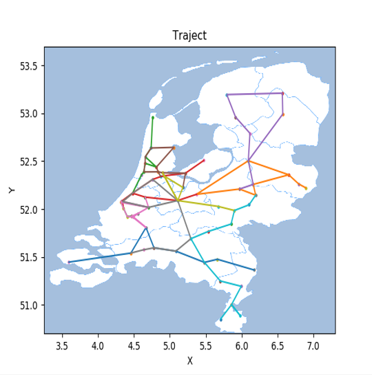

# RailNL
RailNL is responsible for the intercity trains in the Netherlands. The purpose
of this case is to take care of the train routes and get the quality of the
routes as high as possible. A train route visits multiple stations and the route
can't be longer than the given time frame.

In the first part of the case we focussed on the provinces North- and
South-Holland. All connections need to be visited and you can use a maximum of
seven trains. Every train isn't allowed to be longer than two hours.

In the second part of the case we focussed on all of the Netherlands. You can
use a maximum of twenty trains and every train isn't allowed to be longer than
three hours.

In the advanced part you can change three connections and see what happens if
a specific station falls out.

There's a function

- K = p * 10000 - ( T * 100 + Min )

Where K = quality of the routes, p = fraction of connections that are visited
between 0 and 1,
T = amount of trains, Min = total time of all trains

Where the purpose of the case is to get K as high as possible.

## Prerequisites
The code is written in Python 3.7.5, in requirements.txt the used packages can
be found. Easy installation can be done by using for Mac pip3 and for Windows
just use pip

```bash
pip3 install -r requirements.txt
```

## Structure
We seperated our code in different folders. In the folder code you have four
folders for algorithms, classes, heuristics and visualization. In the algorithm
folder you can find the different algorithms we used. We have a complete random
solution and simulated annealing solution. Both can be used with or without
heuristics, which you can find in the heuristics folder.
In the folder data contains all input csv files with the connections and
coordinates. Outputfiles contains the highscores and the trains that belong to
that score.

## Usage
We made a user interface so the user can choose North-/South-Holland or Holland,
which algorithms and if heuristics should be used. And the user can choose if a
station should be omitted or different connections should be made (advanced part).
Just run:

```bash
python3 main.py
```

## Highscore

The highest score we acquired is a K of 7348. We got this result after running the random algorithm with all heuristics 3.371.716 times:

' trein_1, "['Vlissingen', 'Roosendaal', 'Dordrecht', 'Breda', 'Tilburg', 'Eindhoven', 'Helmond', 'Venlo']"
' trein_2, "['Enschede', 'Hengelo', 'Almelo', 'Zwolle', 'Amersfoort', 'Apeldoorn', 'Zutphen', 'Deventer', 'Almelo']"
' trein_3, "[Den Helder', 'Alkmaar', 'Castricum', Zaandam', 'Beverwijk', 'Haarlem', 'Heemstede'Aerdenhout', 'Leiden Centraal', 'Den Haag HS', 'Delft', 'Schiedam Centrum', 'Rotterdam Centraal']"
' trein_4, "['Lelystad Centrum', 'Almere Centrum', 'Amsterdam Amstel', 'Amsterdam Zuid', 'Schiphol Airport', 'Leiden Centraal', 'Den Haag Laan v NOI', 'Delft', 'Den Haag Centraal', 'Leiden Centraal', 'Alphen a/d Rijn', 'Utrecht Centraal', 'Amersfoort']"
' trein_5, "['Zwolle', 'Assen', 'Groningen', 'Leeuwarden', 'Heerenveen', 'Steenwijk', 'Zwolle', 'Deventer', 'Apeldoorn']"
' trein_6, "['Hilversum', 'Almere Centrum', 'Amsterdam Centraal', 'Amsterdam Sloterdijk', 'Zaandam', 'Hoorn', 'Alkmaar', 'Castricum', 'Beverwijk', 'Haarlem', 'Amsterdam Sloterdijk', 'Amsterdam Zuid']"
' trein_7, "['Den Haag Centraal', 'Gouda', 'Rotterdam Alexander', 'Rotterdam Blaak', 'Dordrecht', 'Rotterdam Centraal', 'Rotterdam Alexander', 'Rotterdam Blaak', 'Schiedam Centrum', 'Delft', 'Den Haag HS', 'Gouda', 'Alphen a/d Rijn']"
' trein_8, "[Roosendaal', 'Etten'Leur', 'Breda', 'Tilburg', 's'Hertogenbosch', 'Utrecht Centraal', 'Gouda', 'Den Haag Laan v NOI', 'Leiden Centraal', 'Schiphol Airport', 'Utrecht Centraal']"
' trein_9, "['Amsterdam Amstel', 'Amsterdam Centraal', 'Utrecht Centraal', 'Hilversum', 'Amsterdam Amstel', 'Utrecht Centraal', 'Ede'Wageningen', 'Arnhem Centraal']"
' trein_10, "['Zutphen', 'Dieren', 'Arnhem Centraal', 'Nijmegen', 'Oss', 's'Hertogenbosch', 'Eindhoven', 'Weert', 'Roermond', 'Sittard', 'Heerlen', 'Sittard', 'Maastricht']"

#### Visualisation:



## Authors
Yana Visscher, Abel van Gennep and Emma de Gier
